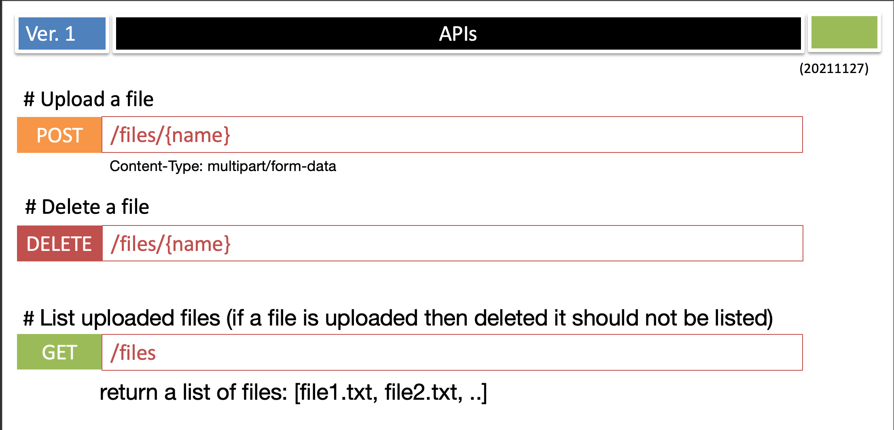
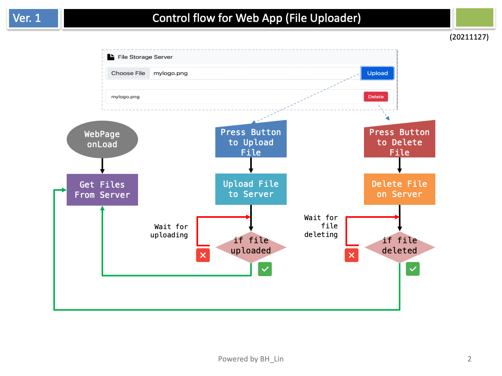
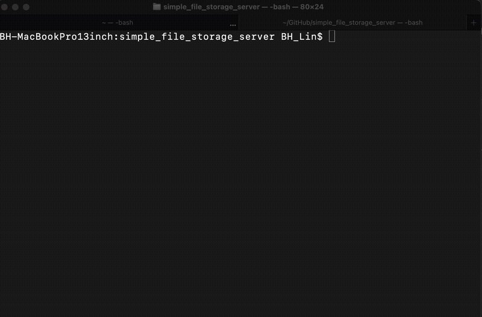

  
Simple File Storage Server
================================================

This is a simple file storage server.   
User can upload file,  delete file and list file on the server. 

If you want to build and run the server locally, here is the user guide. 

## Table of Contents
<!-- START doctoc generated TOC please keep comment here to allow auto update -->
<!-- DON'T EDIT THIS SECTION, INSTEAD RE-RUN doctoc TO UPDATE -->
- [Simple File Storage Server](#simple-file-storage-server)
  - [Table of Contents](#table-of-contents)
  - [On Server Side](#on-server-side)
    - [Prepare your Go Environment](#prepare-your-go-environment)
    - [Start Back-End Server](#start-back-end-server)
  - [On Front-End Side](#on-front-end-side)
    - [Start Web Server to interact with server](#start-web-server-to-interact-with-server)
  - [Control flow for web app](#control-flow-for-web-app)
  - [How to run test cases](#how-to-run-test-cases)
  - [Demo on WebSite](#demo-on-website)
  - [How to Use CLI for Testing.](#how-to-use-cli-for-testing)
  - [Demo on CLI](#demo-on-cli)
  - [Use Docker to start the server](#use-docker-to-start-the-server)
<!-- END doctoc generated TOC please keep comment here to allow auto update -->

## On Server Side
### Prepare your Go Environment
Download and install  
<https://go.dev/doc/install>  

### Start Back-End Server
Start the go server and listen the port 8080
```shell
cd backend;
go run main.go
```

Here is the APIs provided by Server 


## On Front-End Side
### Start Web Server to interact with server 
You can use your favorite http-server.
(in this case, I use this https://formulae.brew.sh/formula/http-server)
```
cd frontend;
http-server --cors;
```
After launching the web server, you can visit the website. 
  
Now, you can choose file to upload.  

Once you have uploaded a file (ex: mylogo.png), 
you can see there will be a file on the list. 


## Control flow for web app


## How to run test cases
```shell
cd backend; 
go test -v ./
```


## Demo on WebSite


## How to Use CLI for Testing. 
- Command to Upload file to server 
```shell
curl -v -F filename=image.jpg \
    -F file2upload=@mylogo.png \
    http://localhost:8080/files/mylogo.png
```
- Command to list files on server
```shell
curl --location --request GET 'http://localhost:8080/files'
## Sample of output 
## {"files":["mylogo.png"]}
```
- Command to delete files on server 
```shell
curl --location --request DELETE 'http://localhost:8080/files/mylogo.png'
```
## Demo on CLI


## Use Docker to start the server
Input following command in the root folder.
Then, visit the website "http://localhost:8081"
```shell
docker-compose up -d
```



