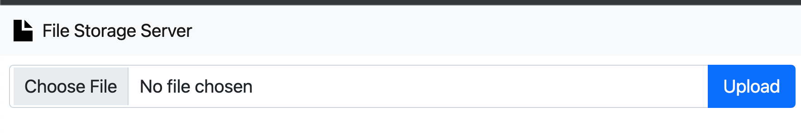
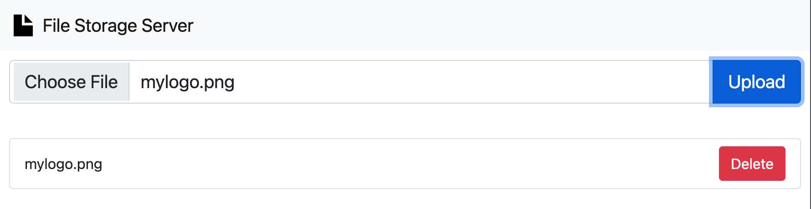
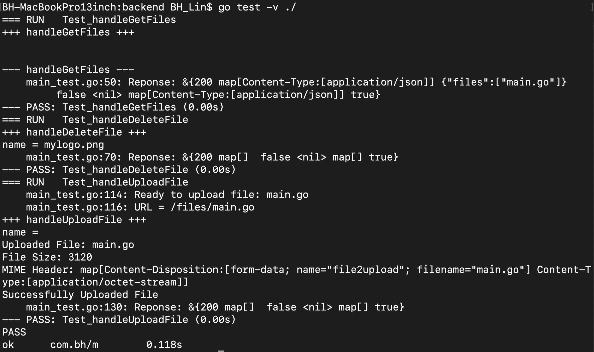
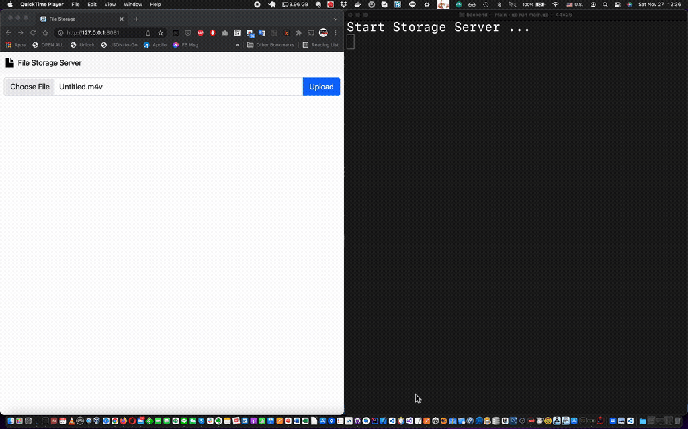
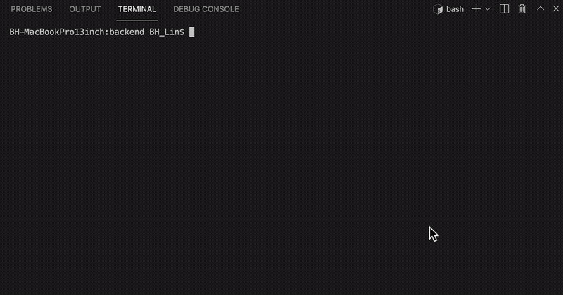

  
Simple File Storage Server
================================================

This is a simple file storage server.   
User can upload file,  delete file and list file on the server. 

If you want to build and run the server locally, here is the user guide. 

## On Server Side
### Prepare your Go Environment
Download and install  
<https://go.dev/doc/install>  

### Start Backend Server
Start the go server and listen the port 8080
```shell
cd backend;
go run main.go
```

## On FrontEnd Side
### Start Web Server to interact with server 
You can use your favorite http-server.
(in this case, I use this https://formulae.brew.sh/formula/http-server)
```
cd frontend;
http-server --cors;
```
After launching the web server, you can visit the website. 
  
Now, you can choose file to upload.  

Once you have uploaded a file (ex: mylogo.png), 
you can see there will be a file on the list. 


## How to run test cases
```shell
cd backend; 
 go test -v ./
```


## Demo on WebSite


## How to Use CLI for Testing. 
- Command to Upload file to server 
```shell
curl -v -F filename=image.jpg \
    -F file2upload=@mylogo.png \
    http://localhost:8080/files/mylogo.png
```
- Command to list files on server
```shell
curl --location --request GET 'http://localhost:8080/files'
## Sample of output 
## {"files":["mylogo.png"]}
```
- Command to delete files on server 
```shell
curl --location --request DELETE 'http://localhost:8080/files/mylogo.png'
```
## Demo on CLI



